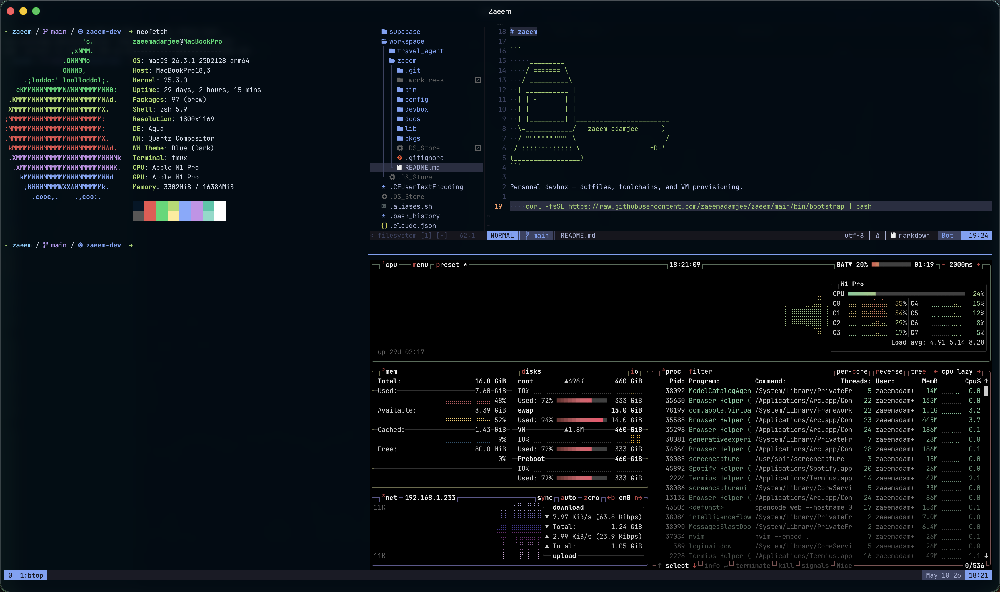

# zaeem



```
     _________
    / ======= \
   / __________\
  | ___________ |
  | | -       | |
  | |         | |
  | |_________| |________________________
  \=____________/   zaeem adamjee      )
  / """"""""""" \                       /
 / ::::::::::::: \                  =D-'
(_________________)
```

Personal devbox — dotfiles, toolchains, and VM provisioning.

    curl -fsSL https://raw.githubusercontent.com/zaeemadamjee/zaeem/main/bin/bootstrap | bash
